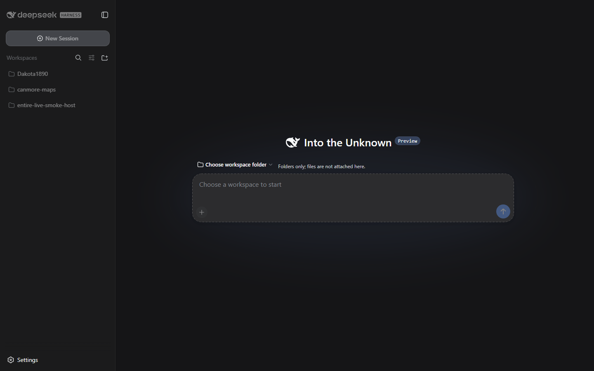
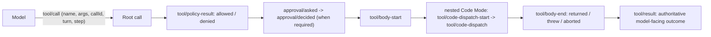
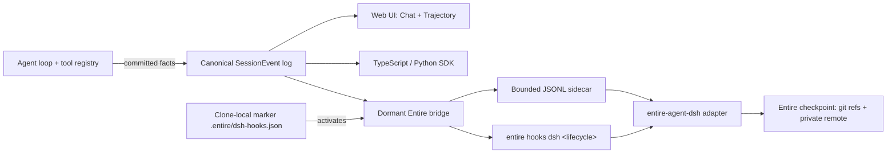
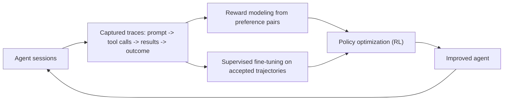

# DeepSeek Harness + Entire.io

English | [中文](README.zh.md)

DeepSeek Harness (`dsh`) is an open-source agent harness developed by [DeepSeek AI](https://deepseek.com). It runs an agent loop where a model reads a workspace, calls tools, and produces changes — and it commits **every observable fact of that process** to a single, append-only trace. This document explains that trace end to end: how tool calling is exposed as events, why capturing those events matters, how they flow into the app and the SDKs, and how the optional [Entire](https://github.com/entireio/cli) bridge turns them into durable, Git-linked checkpoints.

Everything is a plugin, powered by [Cordis](https://github.com/cordiverse/cordis).

## The app

The harness ships a Web UI with two views over the same trace:

- **Chat** — the conversation, with each assistant message and the tool calls it made rendered inline, so you see *what the agent did* as it happened.
- **Trajectory** — a structured, filterable rendering of the session's tool trace: every root tool call with its nested Code Mode sub-calls, policy evaluation, approval decision, body timing, and final result, laid out as a tree with durations. This is the *audit view* — where you go to answer "what exactly did it run, in what order, what did it see, and why."



Both views render from the same canonical `session/event` stream; there is no second source of truth.

## WorkspaceAlberta product profile

This checkout ships an in-box `workspace-alberta` profile on official DeepSeek Harness: the same `dsh` launcher, plugin system, Web UI, and [`dsh-mcp-client`](packages/mcp/mcp-client/README.md). It is not an Electron desktop and does not replace the harness with a toy client. Raspberry Pi hardware, Desktop Electron, gbrain, and the j-space skill stay unchanged.

From this repository, after `pnpm install` and `pnpm run build`:

```sh
pnpm dsh --profile workspace-alberta
pnpm dsh --profile workspace-alberta --dump-default-config
```

First use writes `$DSH_HOME/profiles/workspace-alberta/{package.json,cordis.patch.yml}` from the shipped template (`@deepseek-ai/dsh-base`, `@deepseek-ai/dsh-web-app`, `@deepseek-ai/dsh-workspace-alberta`). The composition source of truth is [`packages/bundle/workspace-alberta/cordis.patch.yml`](packages/bundle/workspace-alberta/cordis.patch.yml). A live `~/.dsh` install (the Pi) must run this fork's `dsh` so that in-box bundle resolves; do not invent a second runtime.

Defaults for that profile: Cohere Command A+ (`COHERE_API_KEY`, Compatibility API `https://api.cohere.ai/compatibility/v1`), official streamable-http MCP at `https://elbowsupknivesout.warreandvavasour.com/mcp` (override with `WORKSPACE_ALBERTA_MCP_URL`; local fallback is `python mcp-servers/canadabuys/server.py` from [HarleyCoops/WorkspaceAlberta](https://github.com/HarleyCoops/WorkspaceAlberta)), and a Composio MCP row gated on `COMPOSIO_API_KEY` / `COMPOSIO_MCP_URL`. No API keys are committed. Details: [`packages/bundle/workspace-alberta/README.md`](packages/bundle/workspace-alberta/README.md).

## The canonical session trace

One log per session, append-only, with every record carrying a sequence number and a timestamp. It is the single source of truth for:

- the model history (what the model actually saw),
- the Chat and Trajectory views,
- the TypeScript and Python SDKs,
- persistence and replay,
- telemetry and compaction,
- the Entire export.

The rule is **model-visible means logged**: anything that reaches a model request must be reconstructable from the log, and a runtime invariant asserts it. Adding a new model-visible input means adding a new session event.

## How tool calling is exposed

Every tool interaction is committed as a typed sequence of events that join together by call identity. A single call's full lifecycle is reconstructable — including nested sub-calls and their timing — with no second trace stream.



- **`tool/call`** — the root invocation: `name`, parsed `arguments`, a stable `callId`, plus the `turn` and `step`.
- **`tool/policy-result`** — the outcome and source of policy evaluation (was the call allowed or denied before dispatch).
- **`approval/asked` → `approval/decided`** — the audit pair when the call required human approval.
- **`tool/body-start` / `tool/body-end`** — bracket the actual execution; `body-end` records only returned/threw/aborted.
- **`tool/code-dispatch-start` / `tool/code-dispatch`** — each nested Code Mode sub-call, with `rootCallId`/`parentCallId`/`subCallId`, so the full tree is preserved.
- **`tool/result`** — the final, authoritative model-facing result after validation and post-execution policy.

Because every event carries a timestamp, policy wait, body duration, and total duration are all reconstructable.

## The trace flow



## Why capture traces

A trace is the difference between "the agent ran" and "here is exactly what the agent did, and why." Capturing it enables:

- **Debugging** — trace a wrong result back to the exact tool call, its arguments, and its output.
- **Reproducibility** — replay a session from the log; nothing the model saw is missing.
- **Audit and safety** — every policy decision and approval is recorded, so you can prove what was and was not allowed.
- **Search and resume** — with Entire checkpoints, find past work and continue it.
- **Training** — the traces are the raw material for improving the agent itself (below).

## Traces and RL development

Every completed session is a **trajectory**: a sequence of *(observation, action, outcome)* — the user prompt, each assistant turn with its tool calls, each tool result, and the eventual acceptance or correction. That is exactly the shape that reinforcement-learning (RL) post-training consumes.



Capturing traces makes this loop concrete:

- **Supervised fine-tuning** — accepted trajectories are high-quality demonstrations of *what a good run looks like*.
- **Reward modeling** — pairs of accepted and rejected completions teach a reward model what outcomes are desirable.
- **RL** — the policy is optimized against that reward model over many trajectories, closing the loop.

The harness contributes the durable, complete, and exportable trajectories — every tool call, result, timing, policy outcome, and approval — in a normalized form (the sidecar / Entire checkpoint) ready for that pipeline.

## Logging traces into Entire

[Entire](https://github.com/entireio/cli) is a separate tool that creates Git-linked checkpoints of agent work: a checkpoint pairs the Git changes a session produced with the trace of what the agent did, so it can be reviewed, searched, and resumed.

The integration is optional and off by default. It is implemented by the base-bundle plugin `@deepseek-ai/dsh-entire-bridge` (`packages/hooks/entire-bridge`), a dormant observer of the session log.

### Activation

The bridge activates only when the trusted `entire-agent-dsh` adapter installs the exact clone-local marker:

```json
{"schemaVersion":1,"agent":"dsh"}
```

The marker is clone-local by design: cloning the repository never installs or executes the adapter, and the bridge never creates the marker itself.

### What happens once active

When a session starts in a marked clone, the bridge:

1. projects committed facts into a normalized JSONL sidecar — one line per event — beneath the OS temporary directory (`<temp>/entire-dsh/<sha256-of-repository-root>/sessions/<session-id>.jsonl`);
2. writes a body-free reference at `.entire/tmp/dsh-<session-id>.json`;
3. emits fixed-argument lifecycle hooks — `session-start`, `turn-start`, `turn-end`, `compaction`, `session-end`, `subagent-start`, `subagent-end` — via `entire hooks dsh <hook>` with one versioned JSON payload on stdin.

The adapter reads the sidecar, reassembles the tool trace, and produces the Entire checkpoint.

### What is captured

The default projection includes true user prompts, committed assistant messages and usage, root `tool/call`/`tool/result`, nested Code Mode dispatches, `tool/policy-result`, the approval audit pair, `tool/body-start`/`body-end` timing, compaction, and lineage. It omits system prompts, request headers, tool schemas, environment data, credentials, and raw assistant chunks; obvious credential-key values are masked and oversized tool results are byte-capped. A `strict` mode further omits tool inputs/results and reasoning-like content.

### Guarantees

The bridge observes committed events **after** model work: it adds no prompt content or tools, consumes no model tokens, and cannot change a model request, an approval, a tool execution, or a tool result. Sidecar and hook failures are warnings only. Entire's Git diff remains the authoritative record of file changes.

### Enabling

```sh
entire-agent-dsh info
entire enable --local --agent dsh --checkpoint-remote github:OWNER/PRIVATE_REPO
```

### Storage and security

Sidecars and native session logs are sensitive local data. Use a separate private checkpoint remote and review a checkpoint before its first push. Masking is best effort.
