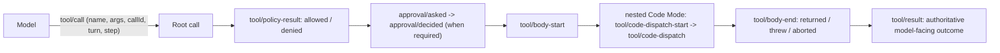
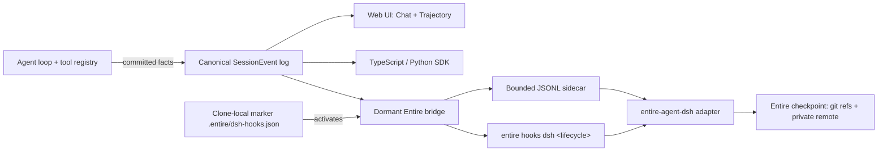
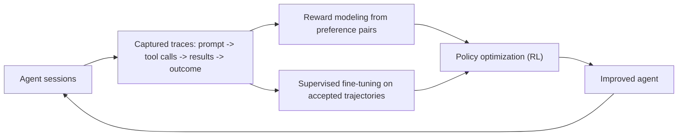

# DeepSeek Harness

[English](README.md) | 中文

DeepSeek Harness（`dsh`）是由 [DeepSeek AI](https://deepseek.com) 开发的开源 agent harness。它运行一个 agent 循环：模型读取工作区、调用工具并产生变更——并把**这个过程中的每一个可观测事实**提交到唯一一条仅追加的追踪日志中。本文档端到端地解释这条追踪：工具调用如何暴露为事件、为什么捕获这些事件很重要、它们如何流入 App 与 SDK，以及可选的 [Entire](https://github.com/entireio/cli) bridge 如何把它们变成持久的、与 Git 关联的检查点。

一切皆插件，由 [Cordis](https://github.com/cordiverse/cordis) 驱动。

## App

Harness 附带一个 Web UI，用两种视图呈现同一条追踪：

- **Chat** —— 对话视图，每条 assistant 消息及其发起的工具调用以内联方式渲染，让你看到 *agent 当时做了什么*。
- **Trajectory** —— 会话工具追踪的结构化、可筛选渲染：每个根工具调用连同其嵌套 Code Mode 子调用、策略评估、审批决定、执行体计时与最终结果，以带时长的树形结构展示。这是*审计视图*——用于回答“它到底运行了什么、按什么顺序、看到了什么、为什么”。

两个视图都从同一条规范的 `session/event` 流渲染；不存在第二个事实来源。

## 规范会话追踪

每个会话一条日志，仅追加，每条记录带有序号与时间戳。它是以下内容的唯一事实来源：

- 模型历史（模型实际看到的内容）；
- Chat 与 Trajectory 视图；
- TypeScript 与 Python SDK；
- 持久化与重放；
- 遥测与压缩；
- Entire 导出。

规则是**模型可见即已记录**：任何进入模型请求的内容都必须能从日志重建，并由运行时不变式断言。新增模型可见输入就意味着新增一种会话事件。

## 工具调用如何暴露

每一次工具交互都提交为一串类型化事件，它们通过调用标识相互关联。一次调用的完整生命周期可重建——包括嵌套子调用及其计时——而无需第二条追踪流。



- **`tool/call`** —— 根调用：`name`、解析后的 `arguments`、稳定的 `callId`，以及 `turn` 与 `step`。
- **`tool/policy-result`** —— 策略评估的结果与来源（调用在派发前被放行还是拒绝）。
- **`approval/asked` → `approval/decided`** —— 需要人工审批时的审计对。
- **`tool/body-start` / `tool/body-end`** —— 框定实际执行；`body-end` 只记录返回/抛出/中止。
- **`tool/code-dispatch-start` / `tool/code-dispatch`** —— 每个嵌套 Code Mode 子调用，带 `rootCallId`/`parentCallId`/`subCallId`，保留完整树形结构。
- **`tool/result`** —— 经校验与执行后策略之后的最终、权威的模型可见结果。

由于每条事件都带时间戳，策略等待、执行体时长与总时长都可重建。

## 追踪流



## 为什么捕获追踪

追踪是“agent 运行了”与“这是 agent 到底做了什么、为什么”之间的差别。捕获它可实现：

- **调试** —— 把错误结果回溯到确切的工具调用、其参数与输出。
- **可复现** —— 从日志重放会话；模型所见无遗漏。
- **审计与安全** —— 每次策略决策与审批都被记录，可证明什么被允许、什么未被允许。
- **搜索与续做** —— 借助 Entire 检查点，查找过去的工作并继续。
- **训练** —— 追踪是改进 agent 本身的原始素材（见下文）。

## 追踪与 RL 开发

每个完成的会话都是一条**轨迹（trajectory）**：(observation, action, outcome) 的序列——用户提示词、每次带工具调用的 assistant 轮次、每个工具结果，以及最终的接受或纠正。这正是强化学习（RL）后训练所消费的形态。



捕获追踪让这个循环落到实处：

- **监督微调（SFT）** —— 被接受的轨迹是“一次好的运行长什么样”的高质量示范。
- **奖励建模（Reward modeling）** —— 接受与拒绝的完成对教奖励模型什么结果是可取的。
- **RL** —— 在大量轨迹上，针对该奖励模型优化策略，闭环。

Harness 提供持久、完整、可导出的轨迹——每次工具调用、结果、计时、策略结果与审批——以规范化形式（伴随文件 / Entire 检查点）直接可用于该流水线。

## 将追踪日志写入 Entire

[Entire](https://github.com/entireio/cli) 是一个独立工具，用于创建与 Git 关联的 agent 工作检查点：一个检查点把会话产生的 Git 变更与该 agent 所做之事的追踪配对，便于审查、检索与续做。

该集成可选且默认关闭。它由基础组合包插件 `@deepseek-ai/dsh-entire-bridge`（`packages/hooks/entire-bridge`）实现，是会话日志的一个休眠观察者。

### 激活

只有受信任的 `entire-agent-dsh` 适配器安装了精确的克隆本地标记后，bridge 才会激活：

```json
{"schemaVersion":1,"agent":"dsh"}
```

标记在设计上就是克隆本地的：克隆仓库绝不会安装或执行该适配器，bridge 也绝不会自行创建该标记。

### 激活后发生什么

当会话在带有标记的克隆中启动时，bridge 会：

1. 把已提交事实投影到规范化的 JSONL 伴随文件中——每条事件一行——位于操作系统临时目录下（`<temp>/entire-dsh/<仓库根目录的 sha256>/sessions/<session-id>.jsonl`）；
2. 在 `.entire/tmp/dsh-<session-id>.json` 写入无正文引用；
3. 发出固定参数的生命周期钩子——`session-start`、`turn-start`、`turn-end`、`compaction`、`session-end`、`subagent-start`、`subagent-end`——通过 `entire hooks dsh <hook>` 每次经 stdin 写入一个带版本的 JSON 载荷。

适配器读取伴随文件，重组工具追踪，并生成 Entire 检查点。

### 捕获内容

默认投影包括真实用户提示词、已提交的 assistant 消息与用量、根级 `tool/call`/`tool/result`、嵌套 Code Mode 派发、`tool/policy-result`、审批审计对、`tool/body-start`/`body-end` 计时、压缩与谱系。它省略系统提示词、请求头、工具 schema、环境数据、凭据与原始 assistant 分片；明显的凭据键值会被掩码，过大的工具结果会按字节截断。`strict` 模式还会进一步省略工具输入/结果与类推理内容。

### 保证

bridge 在模型工作**之后**观察已提交事件：它不增加提示词内容或工具，不消耗模型 token，也不能改变模型请求、审批、工具执行或工具结果。伴随文件与钩子失败仅是警告。Entire 的 Git diff 仍是文件变更的权威记录。

### 启用

```sh
entire-agent-dsh info
entire enable --local --agent dsh --checkpoint-remote github:OWNER/PRIVATE_REPO
```

### 存储与安全

伴随文件与原生会话日志是敏感的本地数据。请使用独立的私有检查点远端，并在首次推送前审查检查点。掩码是尽力而为。
